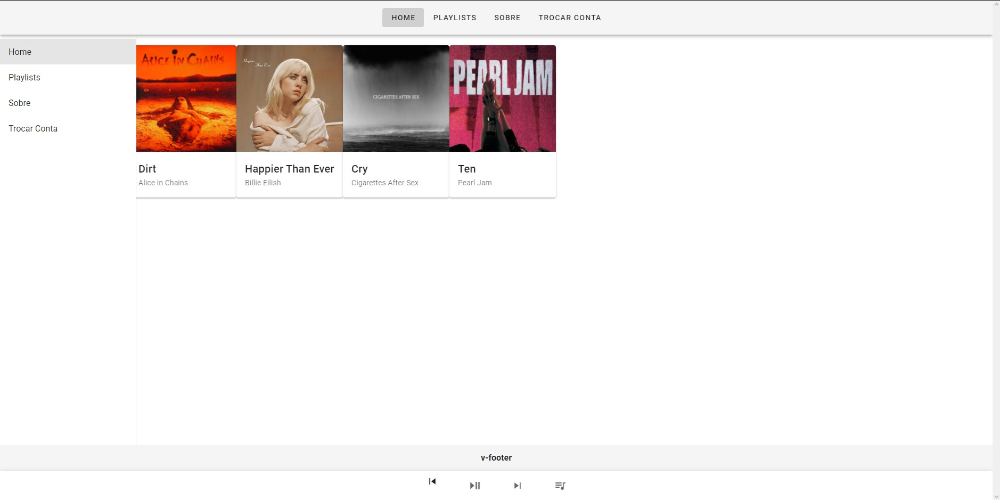
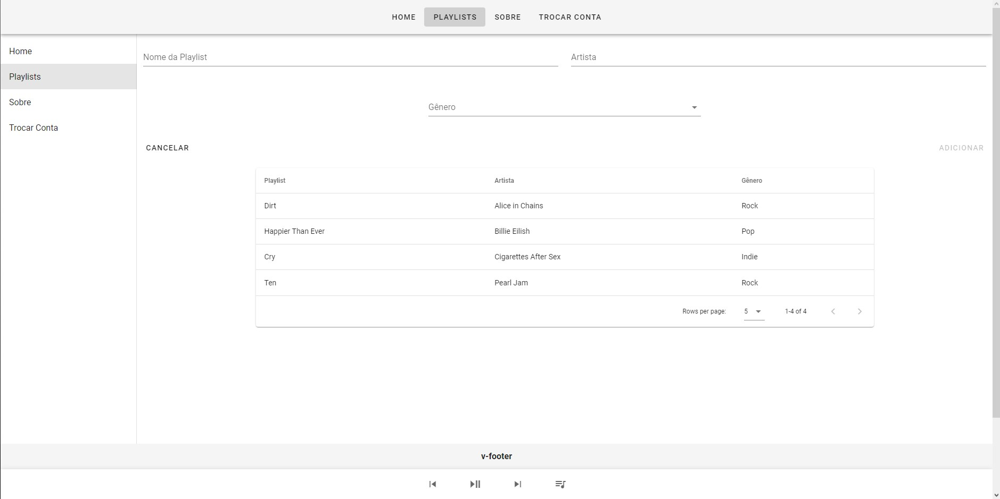
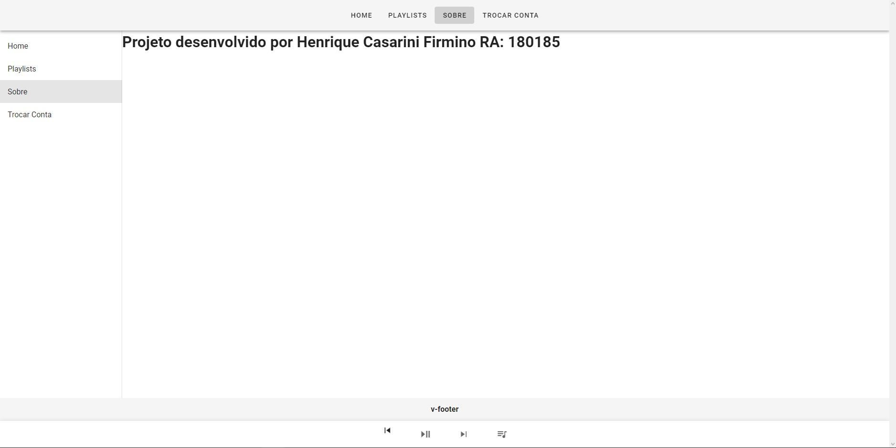
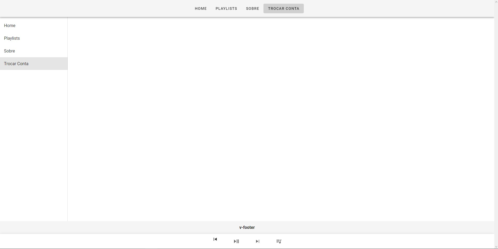

## Project setup
```nn
npm install vue
```

### Compiles and hot-reloads for development
```
npm run serve
```

### Compiles and minifies for production
```
npm run build
```

### Lints and fixes files
```
npm run lint
```

### Customize configuration
See [Configuration Reference](https://cli.vuejs.org/config/).

### Home preview


### Playlists preview


### Sobre preview


### Trocar contas preview


